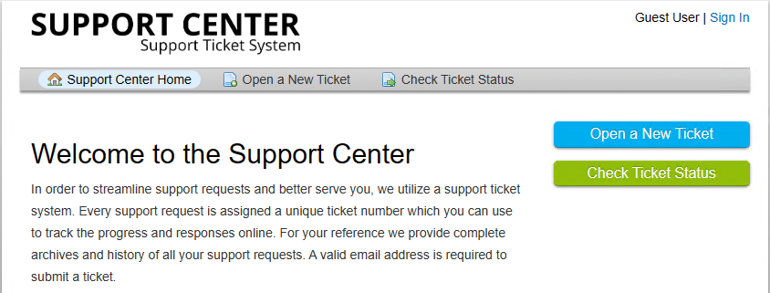
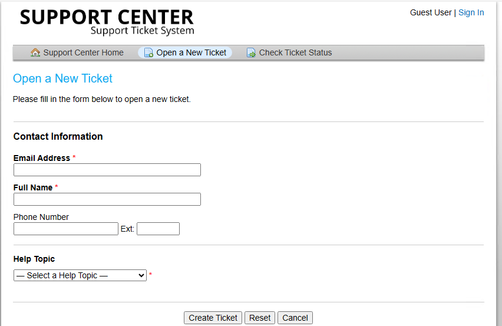
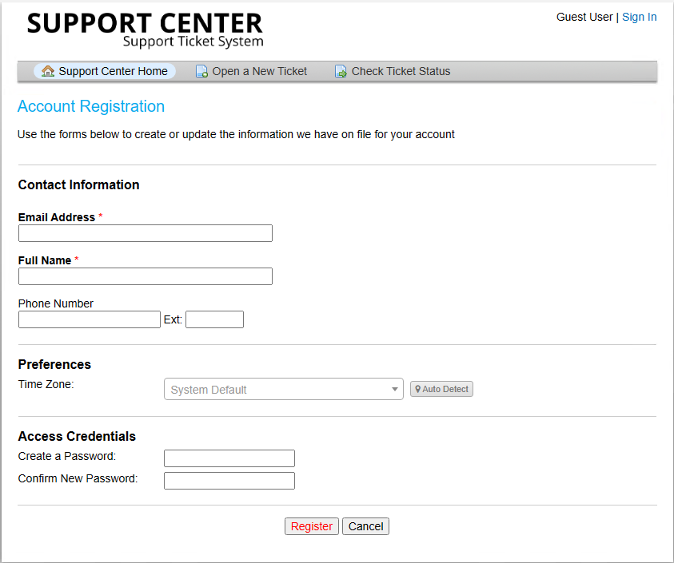
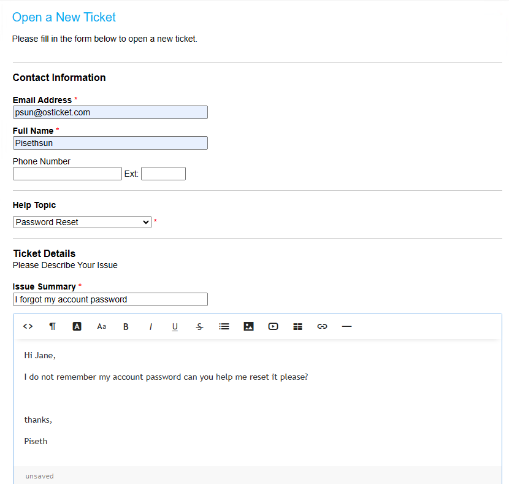
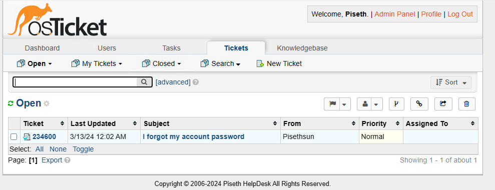

<h1>osTicket - Ticket Lifecycle: Intake Through Resolution</h1>
This tutorial outlines the lifecycle of a ticket from intake to resolution within the open-source help desk ticketing system osTicket. 

<h2>Environments and Technologies Used</h2>

- Microsoft Azure (Virtual Machines/Compute)
- Remote Desktop
- Internet Information Services (IIS)

<h2>Operating Systems Used </h2>

- Windows 10</b> (21H2)

<h2>Ticket Lifecycle Stages</h2>

- Intake
- Assignment and Communication
- Working the Issue
- Resolution

<h2>User Create Tickets</h2>

Link: http://localhost/osTicket/index.php

 

  

 <h3>Fill out the form</h3>
 

  

<strong>From here you can choose Help Topic base on your needs.</strong>

 <h3>Users Can Create An account </h3>

  

  <h4>User Create Ticket</h4>

  

  ## Agent Dashboard 

   <h4>Agent Issue tickets </h4>

  

   <h2>Jane Reply to Piseth Ticket: Example</h2>

  